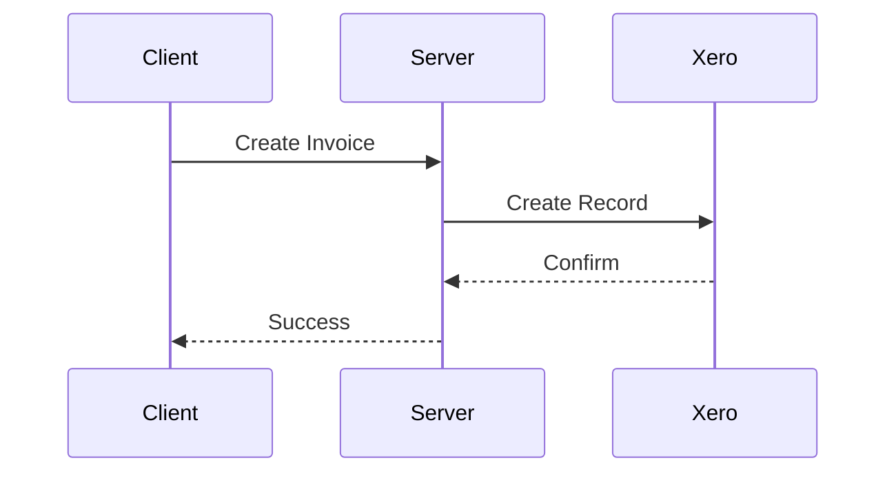

# Xero-Everyware Integration

This application integrates Everyware's payment processing system with Xero's accounting software, automatically creating and reconciling invoices when payments are processed.

## Overview

The integration handles:
- Payment processing through Everyware's Pay By Text system
- Automatic invoice creation in Xero
- Payment reconciliation in Xero
- Refund processing and credit notes

## Documentation

View the full documentation at [https://ayatpunch.github.io/xero-everyware](https://ayatpunch.github.io/xero-everyware)

Or generate locally:

```bash
npm run docs
```

Serve docs locally:

```bash
npm run docs:serve
```

This will serve the documentation at `http://localhost:5000`.

## Setup

1. Install dependencies

```bash
npm install
```

2. Set up environment variables

```bash
cp .env.example .env
```

Edit the `.env` file with your Everyware and Xero credentials

EVERYWARE_API_KEY=your_key
EVERYWARE_USERNAME=your_username
EVERYWARE_BASE_URL=https://rest.everyware.com
XERO_CLIENT_ID=your_client_id
XERO_CLIENT_SECRET=your_client_secret
XERO_REDIRECT_URI=http://localhost:5005/auth/callback
XERO_SCOPES="openid profile email accounting.transactions accounting.settings accounting.contacts offline_access"

3. Run the application

```bash
npm run dev
```

This will start the server and listen for incoming requests.

## API Endpoints

### Authentication
- `GET /auth/xero` - Initiate Xero OAuth flow
- `GET /auth/callback` - OAuth callback handler
- `GET /auth/test` - Test authentication status

### Invoices
- `POST /invoices/create` - Create new invoice
- `GET /invoices/test-create` - Test invoice creation

### Webhooks
- `POST /webhooks/payment` - Handle payment notifications

## Architecture

See the sequence diagrams in the documentation for detailed flows of:
- Invoice Creation and Payment Flow
- Authentication Flow
- Error Handling Flow
- Token Refresh Flow
- Data Transformation Flow
- Refund Flow

Example flow:


## Development

The project uses:
- Express.js for the web server
- Xero Node SDK for accounting integration
- Everyware SDK for payment processing
- JSDoc for documentation

## License

Private - All rights reserved
